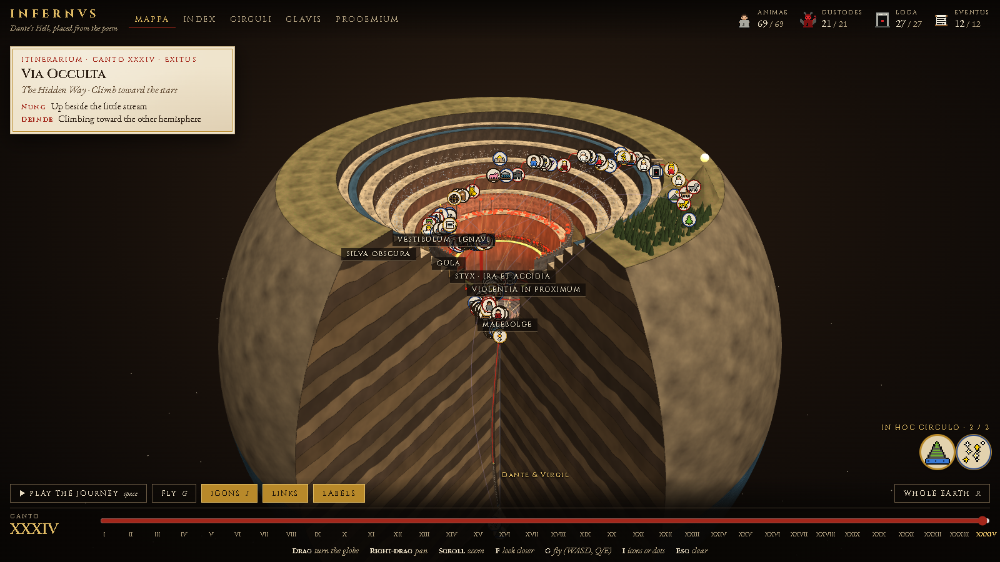
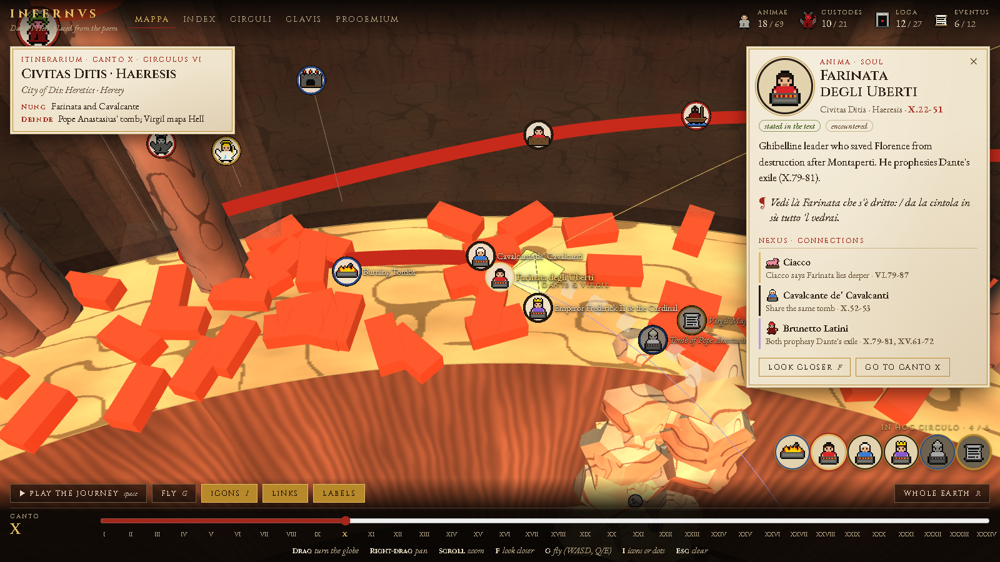
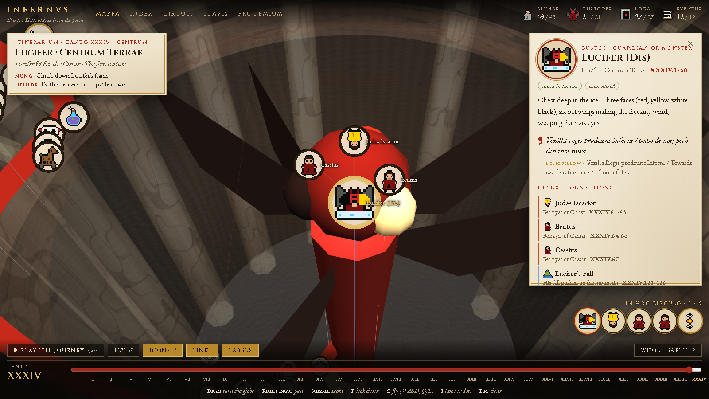
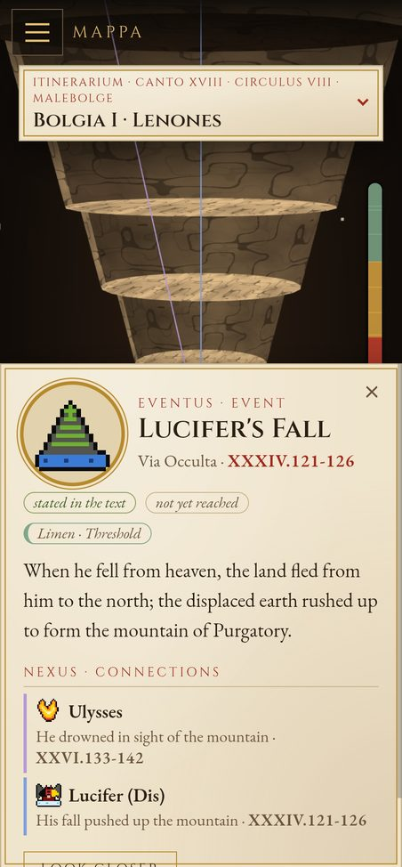
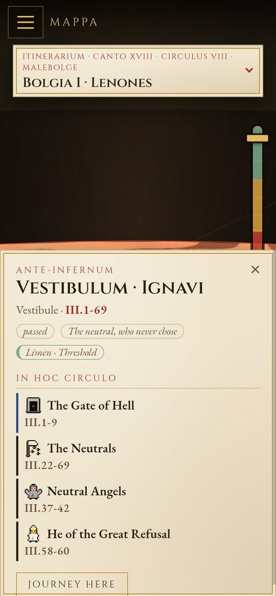
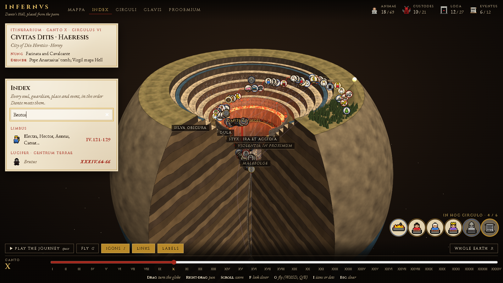
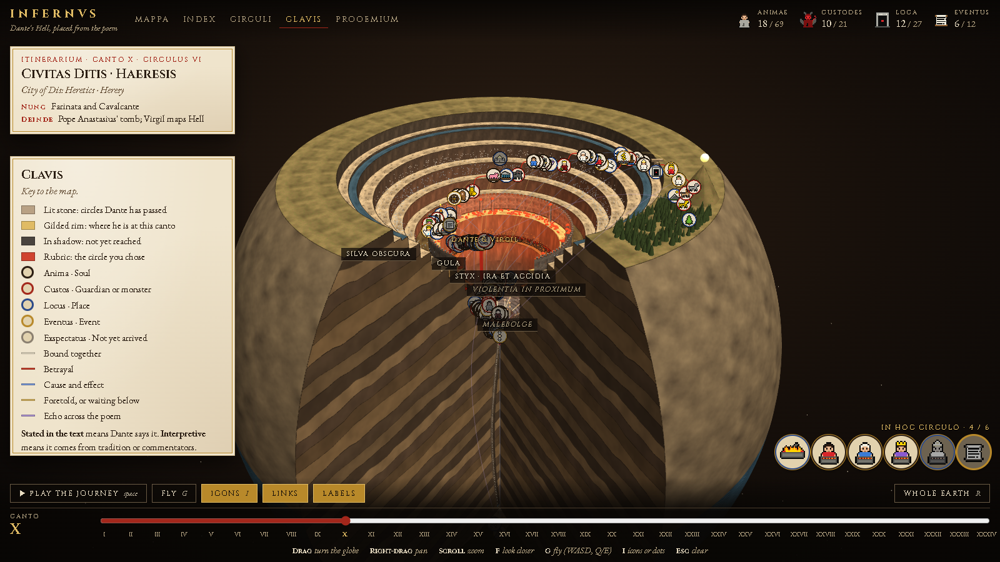
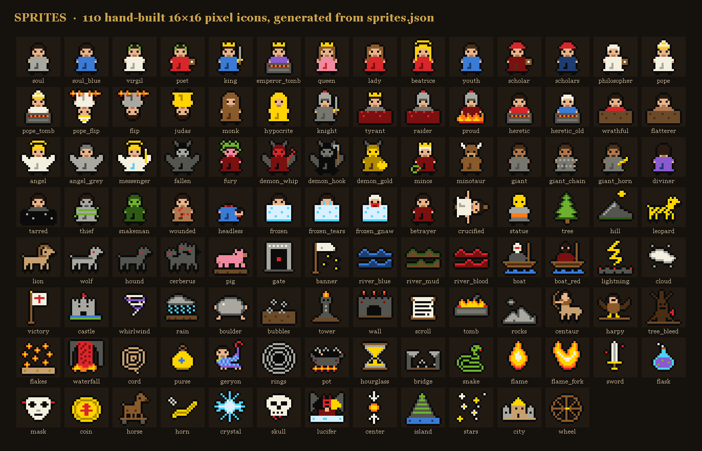

# INFERNVS

**Dante's *Inferno* as a data visualization.** Every soul, guardian, place and event in the poem is a data point with a canto-and-line citation, placed in a 3D cutaway of the Earth and linked to the others.

**Live:** [inferno.pollardjr.com](https://inferno.pollardjr.com) · plain HTML, vanilla JS and Three.js · no framework, no bundler, no backend



- **A cited dataset.** 130 points and 37 links, every one tied to a canto and line.
- **A living model.** 22 animated scenes (a river of blood, a waterfall, crowds pushing weights) play out where the poem puts them. Tap a figure to ask what it is.
- **A guided descent.** Play the journey, or scrub it: the camera follows you down the funnel.
- **Built for phones too.** A full-screen menu, a bottom-sheet card, a depth gauge and touch-sized controls.

## The idea

The *Inferno* is already a structured dataset. Dante gives the geometry (a cone driven into the Earth beneath Jerusalem, narrowing to the planet's center), the ordering (circles, ledges, pits, in a fixed sequence), the cast (who, where, why) and the references between them (who points to whom, who caused whom). It is built as a system, and it can be read like one.

This project takes that structure literally:

- **A cutaway of the globe.** The funnel is modelled from Dante's own description: the descent turns left, bridges break at the sixth pit, and the lowest circle is ice, not fire.
- **Every point is cited.** 130 points, each tied to a canto and line range, such as `X.22-51`. The first Roman numeral also decides when the point appears on the journey.
- **Text versus interpretation is marked.** A tag on each card says whether something is *stated in the text* or *interpretive*, so Dante's claims are never mixed up with commentary.
- **Links are data too.** 37 typed relationships (betrayal, cause and effect, prophecy, echoes across the poem) connect points, drawn on the map and listed on each card.
- **Quotes are public domain.** The Italian is the standard text and the English is H. W. Longfellow (1867). Quotes are checked against published sources, and the log in [`docs/RESEARCH.md`](docs/RESEARCH.md) lists exactly what has been verified and what is still to confirm.

| Count | |
|---|---|
| Points | 130 (69 souls, 21 guardians, 27 places, 12 events, 1 absence) |
| Links | 37 typed relationships |
| Levels | 29 (circles, ledges and pits, from the dark wood to the center) |
| Journey | 78 waypoints through cantos I-XXXIV |
| Icons | 110 original 16×16 sprites |
| Scenes | 22 animated scenes in 13 levels: crowds, rivers, flames and falls |

## Taking the tour

Press **Play the journey** (or the space bar) to follow Dante and Virgil down canto by canto. The pace is gentle, about six minutes end to end, so each circle's scenes have time to play. Rings they have passed light up, the ones ahead stay in shadow, and the counters at top right track how many souls, guardians, places and events you have met.

Or go where you like: drag to turn the globe, scroll to zoom, click any icon to fly to it. The card that opens shows the citation, the Italian line with the Longfellow translation, and its connections.

The **journey bar** along the bottom does the same job by hand. Drag it and the camera follows, so the view always matches the canto. The gold ticks are the first canto of each circle and jump straight there.





## Reading the map

- **Five colour bands.** Rings and levels are tinted by the kind of sin, from the threshold (green) through incontinence (amber), violence (red) and fraud (violet) to treachery (blue). Heresy sits within violence. The key is in the CLAVIS tab.
- **A depth gauge.** A thin bar coloured by those bands runs down the side of the screen, from the surface to the stars past the center. Drag it to travel up and down the funnel without turning the globe.
- **A see-through shell.** The outside of the Earth is half transparent, so the ice at the center and the levels inside can be seen from any angle.
- **Hover to read.** On a desktop, rest the pointer on an icon, a level label or a moving figure and a strip under the header gives the name, the sin, a line of description and the citation. Click to open the full card.
- **First-visit hints.** A short set of pointers shows what to try first. Add `?coach` to the address to see them again.

## Living scenes

The *Inferno* is full of motion: souls driven round in circles, rivers that boil, a waterfall that drops into the next circle. Twenty-two scenes put that motion back where the poem has it. They are built from the same sprites as the icons and tied to their levels, so they dim and brighten with the journey.

- **Each scene says what is staged.** A scene's `conf` field follows the same rule as the rest of the data: it is `text` where the poem states what is happening and `interp` where the movement is the author's reading. Where the poem states the motion, the scene's citation says where. The pace, spacing and number of figures are always staging.
- **Tap a figure to ask what it is.** A scene points at an existing point, so tapping (or hovering) a moving figure opens that point's card with the sin, the punishment, the text and the citation. A scene with no matching point opens its circle's card instead.
- **Motion is optional.** The **Motion** button in the footer turns every scene (and the drifting particles) on and off, and remembers the choice. If your system is set to reduce motion, the scenes start off and the button turns them on. Tapping it shows what it does.

### The weight-pushers (Circle 4, VII.22-35)

The hoarders and wasters roll great weights with their chests, in two opposing half-circles. In the scene, two lines of figures push toward each other, meet in a burst of sparks, pause, and turn back. The second clash falls inside the cut-away wedge, so you see one meeting from the front.

### The river of blood and the falls (XII, XVI)

In the first ring of the seventh circle the blood scrolls round the ring while bubbles rise, souls bob in it, and centaurs patrol the bank (XII.55-75). The poem sinks each soul to a depth that fits its guilt; that detail is on the cards, not in the animation. Further on, **Phlegethon Falls** pour over the great cliff into the eighth circle (XVI.91-105): a red ribbon of water runs down the rock with mist at its foot.

### Geryon's flight (XVI-XVII)

The cord is thrown over the edge, and Geryon comes up out of the dark, waits on the ledge, then carries Dante and Virgil down in slow circles to the first pit (XVII.1-27, XVII.115-117). This one follows the journey bar, not a clock, so you can scrub through it forwards and back and Geryon rises, waits and descends as you go.

### Malebolge in motion

| Pit | What moves | Cite |
|---|---|---|
| Bolgia 1 | Two files of the pandering and seduced walk opposite ways while horned demons lash them | XVIII.25-39 |
| Bolgia 4 | The diviners walk backwards, heads twisted | XX.1-30 |
| Bolgia 5 | The pitch boils | XXI.7-18 |
| Bolgia 6 | The hypocrites trudge in leaden cloaks | XXIII.58-72 |
| Bolgia 7 | Serpents swarm over the thieves | XXIV.82-96 |
| Bolgia 8 | The flames of the false counselors flicker | XXVI.25-42 |
| Bolgia 9 | The sowers of discord circle the ditch | XXVIII.22-63 |

### Smaller touches

The Acheron and the Styx flow, with bubbles rising in the mud of the sullen (VII.118-126), and flames burn on the tombs of the heretics (IX.112-133).

## On a phone

The layout adapts below 900 pixels wide, with the full phone layout under 720.

<p align="center"> </p>

- **A full-screen menu.** The tab bar becomes a hamburger button that opens the five sections as a page of their own.
- **A bottom-sheet card.** Selecting a point or a circle opens its card from the bottom, and the camera shifts so what you picked stays in view above the sheet.
- **The depth gauge on the right edge.** It stops above the sheet, so the thumb is always within reach.
- **The camera follows the slider.** Drag the journey bar or tap a gold tick and the view goes there too.
- **Touch-sized controls.** The footer is compact, the small ticks give way to the gold ones, and the itinerary card folds to a single line until you tap it.
- **Lighter scenes.** The number of figures in each scene is halved, and the pointer-only controls (hover strip, fly mode) step aside.

## The codex

The five tabs at the top are the reference layer, named in Latin to match the tone of the poem.

| Tab | What it is |
|---|---|
| **MAPPA** | The 3D map itself, with the journey slider along the bottom |
| **INDEX** | Every point in the order Dante meets it. Searchable by name, note or canto |
| **CIRCULI** | The circles from the rim to the center, with a *passed / ahead* state for each |
| **CLAVIS** | The key to the map: ring colors, link types and the *stated vs interpretive* tags |
| **PROOEMIUM** | The introduction: how Dante builds Hell, and where the proportions come from (the poem gives few measurements, so scale follows Renaissance reconstructions) |





## The icons

Each point has a 16×16 pixel icon. The sprites are not drawn one by one: [`src/sprites.json`](src/sprites.json) holds a palette, a base figure and a set of modifiers (crown, tiara, hood, wings, flames, tomb, tar, frozen and so on), and the sprite engine stacks them into 110 icons, adds a 1px outline and packs everything into one texture atlas. Icons are colour-ringed by kind: soul, guardian, place or event. Press `I` to switch between icons and plain dots.



## Controls

| Key | Action |
|---|---|
| `Space` | Play or pause the journey |
| Drag / right-drag / scroll | Turn the globe / pan / zoom |
| Pinch / two-finger drag | Zoom / pan on a touch screen |
| Journey bar | Drag to scrub; click a gold tick to jump to a circle |
| Depth gauge | Drag to move up and down the funnel |
| Hover or tap a moving figure | Open the card of the point it belongs to |
| **Motion** button | Turn the animated scenes on or off |
| `F` | Look closer at the selected point |
| `G` | Fly mode (WASD, Q and E) |
| `I` | Toggle icons and dots |
| `R` | Back to the whole Earth |
| `Esc` | Clear the selection |

## Run it locally

The page `fetch()`es its JSON, so it has to be served over HTTP (`file://` will not work).

```bash
npm run dev            # builds dist/ and serves it at http://localhost:5173
```

Add `?motion` to the address to force the animated scenes on even when your system asks for reduced motion (useful for testing). To try it on a phone on the same network, open your computer's address on port 5173.

`npm run build` keeps Three.js on cdnjs. `npm run build:vendor` copies it into `dist/vendor/` so the only third-party request left is Google Fonts. There are no dependencies to install.

## Deployment

`dist/` is the whole site: `index.html`, `inferno.json`, `sprites.json` and `vendor/three.min.js`. All paths are relative, so it works at a domain root or in a subfolder. A [GitHub Actions workflow](.github/workflows/deploy.yml) builds it with `build:vendor` and publishes to GitHub Pages on every push to `main`.

## Under the hood

- [`docs/ARCHITECTURE.md`](docs/ARCHITECTURE.md): how the engine is organized, the data model (coordinates are polar around the funnel axis) and how to add a point or a sprite.
- [`docs/RESEARCH.md`](docs/RESEARCH.md): sources, modelling decisions and the citation verification log.
- [`docs/ROADMAP.md`](docs/ROADMAP.md): the animated scenes and what is left of them, and rollover cards.
- [`docs/PURGATORIO-PLAN.md`](docs/PURGATORIO-PLAN.md): an early sketch of how the same engine could lay out *Purgatorio*.

## Credits and licenses

- This project's own code, data and sprites: MIT (see `LICENSE`).
- Dante Alighieri, *Inferno*; Italian text and H. W. Longfellow's 1867 translation are public domain.
- Three.js r128, MIT (see `vendor/three-r128/LICENSE`).
- Fonts: Cinzel and EB Garamond via Google Fonts (SIL Open Font License).
- Pixel sprites and procedural textures are original to this project.
